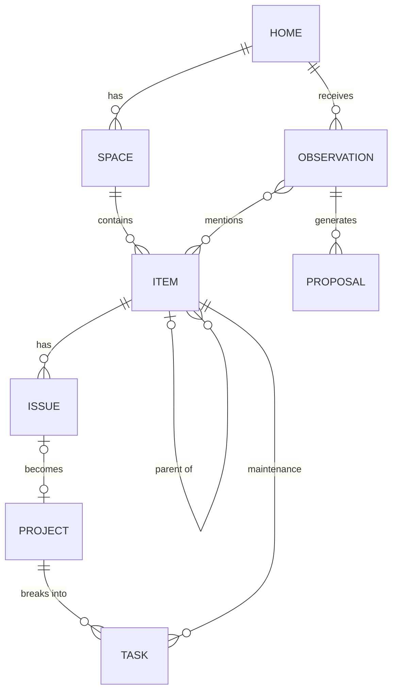

# 03 — Home Ledger Data Model

One sentence: a home is a tree of spaces and items; everything else is either something that happened to them, something to do about them, or a paper trail — and every write arrives as a Proposal.

Recommendation for their open question #3: relational + embeddings + a generic Link table. Not a graph DB. Postgres with pgvector covers it; SQLite + a vector extension is fine for v0.

## Core entities

| Entity | What it is | Key fields |
|---|---|---|
| Home | The vault root. One per household. | id, address, year_built, type, ownership |
| Space | Room or zone: kitchen, attic, north exterior. The spatial backbone. | id, home_id, name, kind, floor |
| Item | Any thing: appliance, system, fixture, material, structural component. Items nest (HVAC → compressor). | id, space_id, parent_id, category, brand, model, serial, installed, installed_certainty, condition, expected_life_years, status |
| Observation | A raw capture: photo, voice transcript, or typed note, plus what the agent extracted. Never deleted — this is provenance. | id, home_id, kind (photo/voice/text), media_ref, transcript, extracted (json), captured_at |
| Proposal | The card. A proposed change to any entity, from an observation or a research finding. | id, source_type (observation/research), source_id, target_type, target_id, change (json), confidence, status (pending/accepted/edited/dismissed), decided_at |
| Issue | A problem on an item or space. | id, item_id, space_id, title, severity, status (open/watching/resolved), first_seen, resolved_at, resolution |
| Project | Scoped work. Can start from an Issue or from nothing. | id, home_id, issue_id, title, scope, status (idea/scoped/quoted/in_progress/done), budget, started_at, finished_at |
| Task | One actionable, optionally recurring. Reminders and check-ins are recurring tasks. | id, project_id, item_id, title, due, recurrence, done_at |

## Paper trail entities (same shape, hang off Home / Item / Project)

| Entity | Key fields |
|---|---|
| Document | id, kind (warranty/manual/receipt/inspection/permit/loan), file_ref, extracted (json), expires, attached_to_type, attached_to_id |
| Money | id, kind (loan/payment/insurance/quote/cost/warranty), amount, cadence, next_due, counterparty_id, attached_to_type, attached_to_id |
| Contact | id, role (contractor/inspector/lender/insurer), name, phone, notes |
| Measurement | id, item_id, metric, value, unit, measured_at, source — the efficacy dataset (energy use, runtime, failure events) |
| Link | id, from_type, from_id, to_type, to_id, kind — for relationships the schema didn't anticipate |

## Relationships

Not drawn: Document, Money, and Contact attach polymorphically via `attached_to_type / attached_to_id`; Measurement is many-to-one on Item; Link is free-form.

## Rules that make it work

1. Every record carries provenance: `source_observation_id`, `stated_by` (owner / agent / research), and `confidence`. Owner-stated facts outrank agent-inferred ones.
2. Uncertain values store the value and its certainty. `installed: 2014, installed_certainty: estimated_from_photo` tells the agent what to ask about later.
3. Raw Observations always save. Everything else lands only through an accepted or edited Proposal. No silent writes.
4. Dismissed Proposals are kept. The agent does not re-propose a dismissed change unless a new Observation or research finding gives new evidence (their rule — adopt verbatim).
5. The semantic layer is not a separate store. Embeddings on Space, Item, and Observation plus the Link table let "the leak under the upstairs bathroom" resolve to the right rows.
6. Voice audio is transcribed and discarded. Photos are kept, encrypted, because they are the record (before/after, condition evidence, insurance proof).

## Deliberately open for v0
- Whether Issue and Task collapse into one "thing to deal with" type
- How deep Item nesting goes before it gets annoying
- Whether Inspection is its own entity or a recurring Task with a Document result
- Whether Proposal `change` is a JSON patch or a full proposed row
